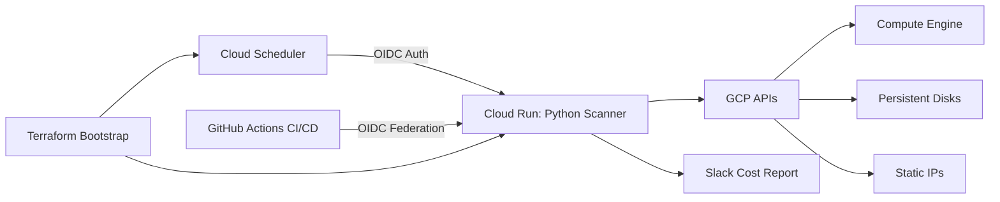
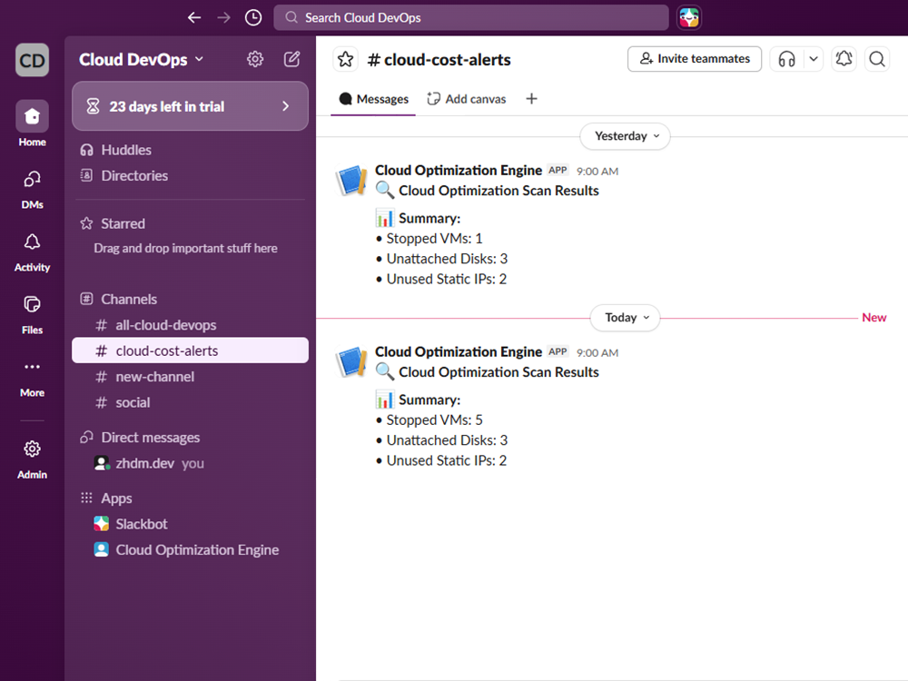
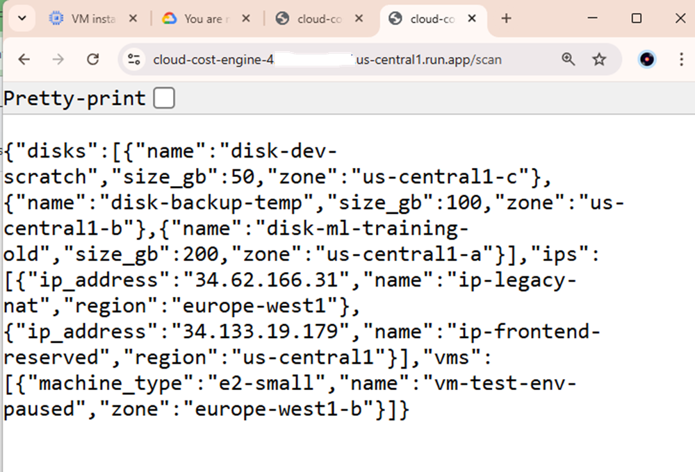
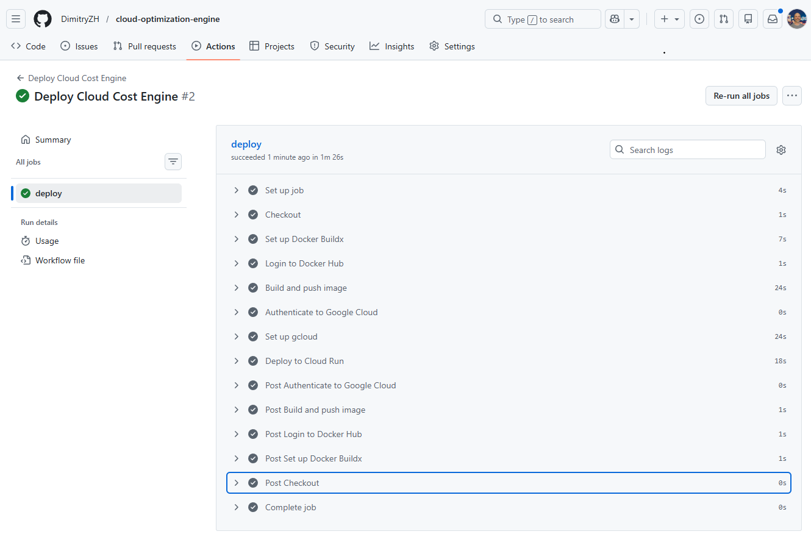
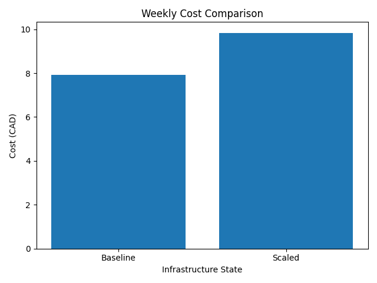
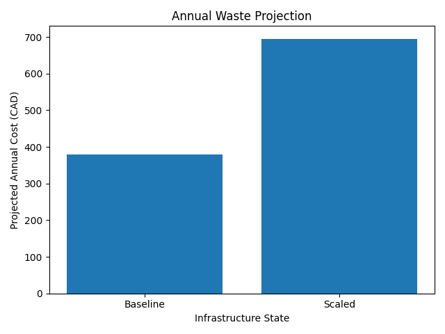
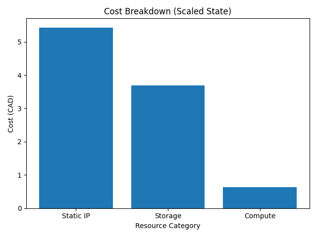

# Cloud Optimization Engine

Automated detection of unused Google Cloud resources - reduce waste, improve governance, and enable FinOps-driven decision making.

## Project Overview

**Cloud Optimization Engine** is a modular, serverless cost-detection system built on Google Cloud.

It automatically scans your GCP environment to detect unused resources and generate structured cost-saving reports via Slack.

**Current Detection Coverage (Demo Scope)**

This implementation includes three production-ready scanners:

- Stopped Compute Engine instances
- Unattached Persistent Disks
- Unused Static IP addresses

These represent common cost leakage scenarios in real cloud environments.

The design makes adding new scanners straightforward.

## Modular Architecture

The runtime is organized as independent scanners feeding one reporting pipeline.

Each scanner:

- Operates independently
- Queries specific GCP APIs
- Returns structured findings
- Integrates into a unified reporting layer

The current repository demonstrates the architecture using **three scanners only**.

The broader **FinOps platform** evolution will expand this into a significantly larger system with **dozens of scanners covering major GCP services and enterprise cost-governance scenarios**.

## Technology Stack

- Python 3.9
- Flask
- Slack SDK
- Docker
- GitHub Actions
- Terraform
- Google Cloud Run
- Cloud Scheduler
- Secret Manager
- Workload Identity Federation (OIDC)

## Architecture



## Live Validation Example

The system has been validated using dynamic Terraform-provisioned resources.

### 1. Automated Slack Cost Report

The scheduled scan produces structured Slack reports with resource summaries.



Daily automated execution - validated via scheduled Cloud Scheduler trigger.

This demonstrates:

- Successful scheduler execution
- Scanner aggregation logic
- Real-time reporting pipeline

### 2. Direct /scan Endpoint Response



Manual validation of the Cloud Run endpoint confirms live detection output:

The JSON response reflects:

- Active resource detection
- Correct zone and region resolution
- Modular scanner aggregation

### 3. CI/CD Deployment Pipeline



The entire deployment is automated via GitHub Actions using secure OIDC authentication.

The pipeline performs:

- Container build
- Docker push
- Cloud Run deployment
- Zero manual credential usage

**This three-step validation confirms full end-to-end automation:**

Terraform -> Cloud Infrastructure -> Cloud Run -> Scheduler -> Slack -> CI/CD

## Security Model

The system follows modern cloud security and IAM best practices:

- Workload Identity Federation (OIDC) for CI/CD authentication
- Dedicated service accounts with least-privilege roles
- Secret Manager integration for webhook configuration
- Terraform-managed IAM bindings
- Scheduler-to-Cloud Run secure invocation
- All infrastructure and identity components are reproducible via Infrastructure as Code.

## Core Capabilities

- Automated daily scanning
- Secure serverless execution (Cloud Run)
- Scheduled invocation (Cloud Scheduler)
- Real-time Slack reporting
- Infrastructure as Code (Terraform)
- Fully automated CI/CD deployment
- IAM reconciliation and reproducibility

## Repository Structure

```txt
app/
    Dockerfile
    app.py
    requirements.txt
    scanners/

terraform-bootstrap/
terraform/

.github/workflows/

docs/
    troubleshooting.md
    deployment_guide.md
    cost_analysis.md
README.md
```

## Run and Deploy

For command-level setup and deployment steps, use:

- [Deployment Guide](docs/deployment_guide.md)
- [Troubleshooting](docs/troubleshooting.md)
- [CI/CD Workflow](.github/workflows/deploy.yml)

## Documentation

This repository includes structured documentation:

- [**deployment_guide.md**](docs/deployment_guide.md): Deployment guide and execution runbook for infrastructure and CI/CD.
- [**cost_analysis.md**](docs/cost_analysis.md): Cost analysis and savings modeling (economic validation).
- [**troubleshooting.md**](docs/troubleshooting.md): Real-world debugging cases encountered during development.

These documents reflect real implementation challenges, validation experiments, and production-hardening steps.

---

## Economic Validation

This project was validated using real Terraform-provisioned infrastructure in a clean Google Cloud environment.

During controlled experiments:

- Idle VMs were detected  
- Unattached disks were identified  
- Reserved static IP addresses were reported  
- Infrastructure was scaled intentionally to measure cost growth  

All financial data was taken from **Billing → Reports → Usage cost ($)**.

The engine demonstrates:

- Real infrastructure cost accumulation  
- Automated waste detection  
- Linear cost growth when idle resources increase  
- Monthly and annual financial projection modeling  

Full detailed breakdown available in:

[cost_analysis.md](docs/cost_analysis.md)

---

## Cost Growth Validation

### Weekly Cost Comparison (Baseline vs Scaled)



The experiment demonstrates measurable cost increase after scaling idle infrastructure.

---

### Annual Waste Projection



Even small unmanaged environments can accumulate significant yearly waste.

---

### Cost Breakdown (Scaled State)



Static IP and persistent storage were the dominant contributors to waste exposure.

---

This validation confirms that Cloud Optimization Engine is not only a detection tool, but a measurable financial governance foundation.

## Project Evolution

This project represents the second stage in a broader FinOps architecture journey:

### Stage 1 - Cloud Cost Optimization: Serverless Intelligence (Client Delivery)

An earlier implementation using serverless automation (Cloud Functions) focused on targeted cost detection.

### Stage 2 - Cloud Optimization Engine (This Repository)

A hardened, containerized, CI/CD-enabled version featuring:

- Modular scanner architecture
- Secure workload identity federation
- Fully automated deployment
- Reproducible Terraform bootstrap
- Scheduled scanning automation

### Stage 3 - FinOps Assessment Platform (Next Evolution - Upwork Project Catalog)

The next iteration expands this architecture into a comprehensive FinOps platform:

- Organization-level analysis
- Cross-project scanning
- Governance scoring
- Risk-based prioritization
- Dozens of scanners covering major cloud services

The current repository serves as the architectural foundation for that larger system.

**The first and third stages can be found on my Upwork profile**.

## Author

**Dmitry Zhuravlev**
Cloud DevOps Engineer
