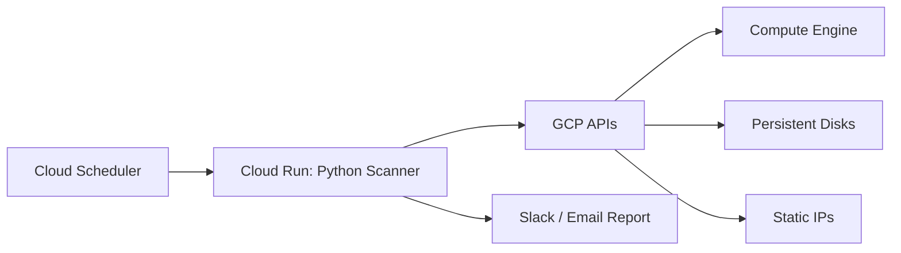

#  GCP Cloud Optimization Engine

Automated detection of unused Google Cloud resources — reduce waste, save costs, improve cloud governance.

## Overview

This project deploys a serverless Python-based scanner that automatically finds idle GCP resources:
- Stopped Compute Engine instances
- Unattached Persistent Disks
- Unused Static IP addresses

and generates real-time cost-saving reports.

## Architecture

## Deployment Summary

1. Deploy infrastructure with Terraform  
2. Build container with Cloud Build  
3. Deploy scanner to Cloud Run  
4. Trigger scan or schedule daily execution  
5. Receive Slack report  

## Author

Dmitry Zhuravlev
Cloud DevOps Engineer
